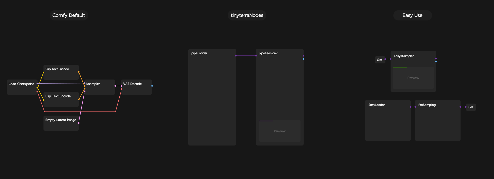
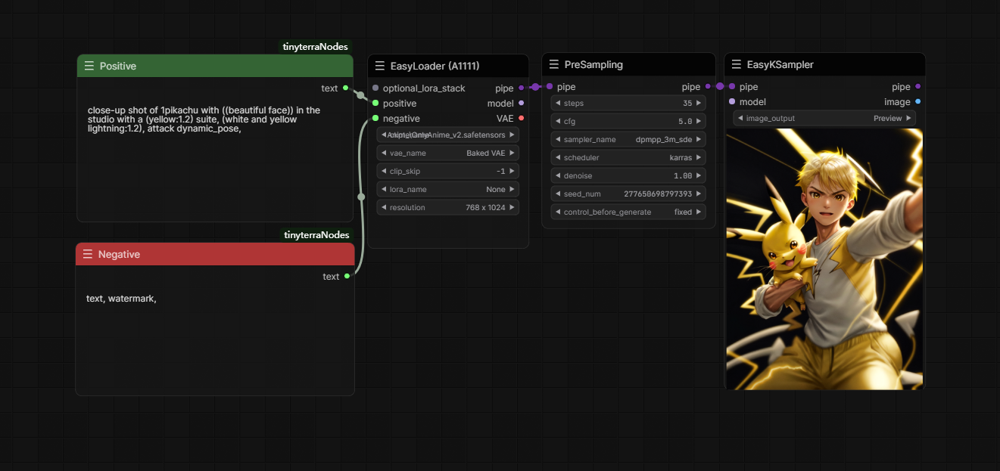
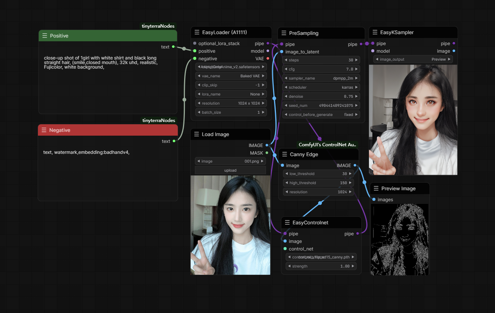
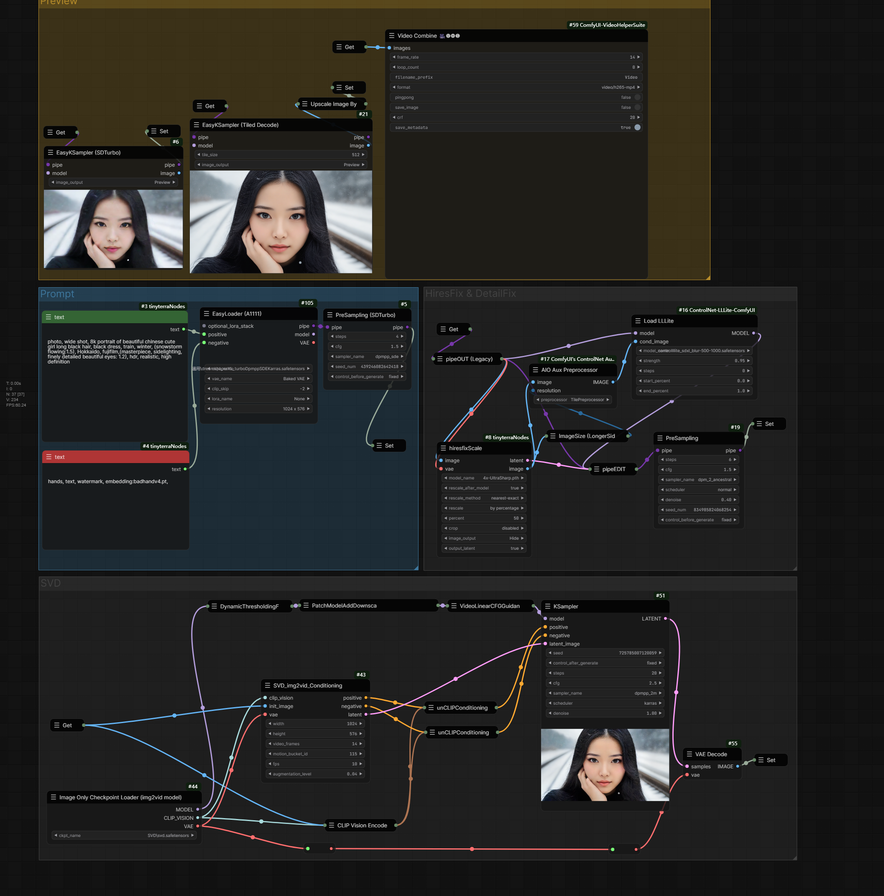

   <a href="./README.md">中文</a> | <strong>English</strong>

# ComfyUI Easy Use

In order to make it easier to use the ComfyUI, I have made some optimizations and integrations to some commonly used nodes.

[//]: # ([![Bilibili Badge]&#40;https://img.shields.io/badge/使用说明视频-00A1D6?style=for-the-badge&logo=bilibili&logoColor=white&link=https://space.bilibili.com/1840885116&#41;]&#40;https://space.bilibili.com/1840885116&#41;)

## Workflow comparison

EasyUse is simplified on the basis of [tinyterraNodes](https://github.com/TinyTerra/ComfyUI_tinyterraNodes), and it is recommended to use it with the original [tinyterraNodes](https://github.com/TinyTerra/ComfyUI_tinyterraNodes) package.

### Updated

- **[Updated 12/11/2023]** Added the `showSpentTime` node to display the time spent on image diffusion and the time spent on VAE decoding images

### Major optimizations

- The **preSampling** node has been added to separate the sampling parameter configuration from the real-time preview image at the time of sampling。
- Adjust the default generation timing of the seed, change **Control After Generate** to **Control Before Generate**.

## Workflow Examples

### Text to image

### Image to image + controlnet

### SDTurbo + HiresFix + SVD

