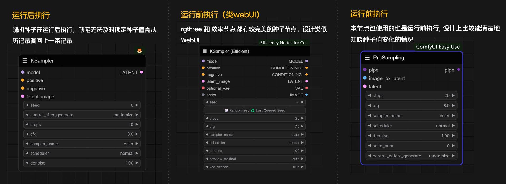
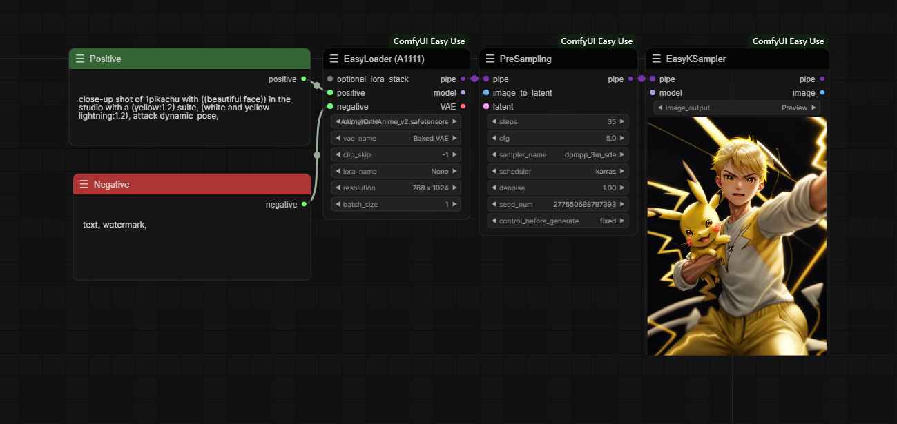
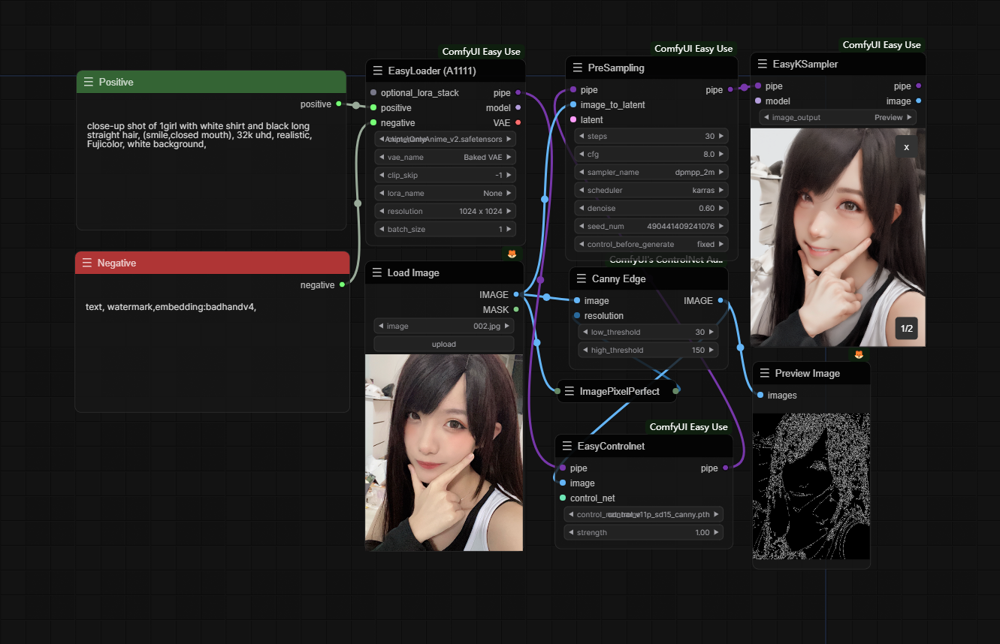
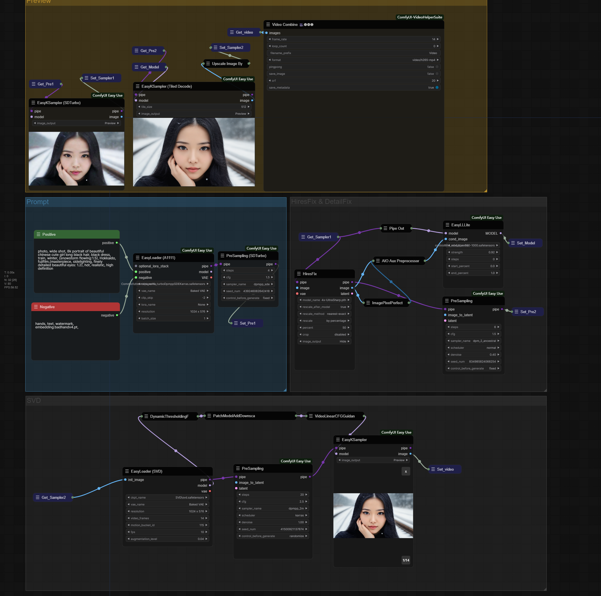

   <a href="./README.md">中文</a> | <strong>English</strong>

# ComfyUI Easy Use

**ComfyUI-Easy-Use** is a simplified node integration package, which is extended on the basis of [tinyterraNodes](https://github.com/TinyTerra/ComfyUI_tinyterraNodes), and has been integrated and optimized for many mainstream node packages to achieve the purpose of faster and more convenient use of ComfyUI. While ensuring the degree of freedom, it restores the ultimate smooth image production experience that belongs to Stable Diffusion.

## Introduce

**Incompatibility Notice**: Not compatible with the current version of the [cg-use-everywhere](https://github.com/chrisgoringe/cg-use-everywhere) node package at this time

### Random species

### Separate sampling parameters from sample preview

### Wildcard and Lora prompt nodes are supported

Support `.yaml`, `.txt`, `.json` format wildcard files, just place them in the 'wildcards' folder of the node package, and update the file to run ComfyUI again.  
To use the Lora Block Weight usage, make sure that [ComfyUI-Inspire-Pack](https://github.com/ltdrdata/ComfyUI-Inspire-Pack) is installed in the custom node package.

### The UI interface is beautified

After installing the node package, the UI interface will be automatically switched, if you need to change other themes, please switch and refresh the page in Settings -> Color Palette.

## Changelog

**v1.0.0（Updated at 12/24/2023 GMT+0800）**

- Added `easy positive` - simple positive prompt text
- Added `easy negative` - simple negative prompt text
- Added `easy wildcards` - support for wildcards and hint text selected by Lora
- Added `easy portraitMaster` - PortraitMaster v2.2
- Added `easy loraStack` - Lora stack
- Added `easy fullLoader` - full version of the loader
- Added `easy zero123Loader` - simple zero123 loader
- Added `easy svdLoader` - easy svd loader
- Added `easy fullkSampler` - full version of the sampler (no separation)
- Added `easy hiresFix` - support for HD repair of Pipe
- Added `easy predetailerFix` and `easy DetailerFix` - support for Pipe detail fixing
- Added `easy ultralyticsDetectorPipe` and `easy samLoaderPipe` - Detect loader (detail fixed input)
- Added `easy pipein` `easy pipeout` - Pipe input and output
- Added `easy xyPlot` - simple xyplot (more controllable parameters will be updated in the future)
- Added `easy imageRemoveBG` - image to remove background
- Added `easy imagePixelPerfect` - image pixel perfect
- Added `easy poseEditor` - Pose editor
- New UI Theme (Obsidian) - Auto-load UI by default, which can also be changed in the settings 

- Fixed `easy imageSize`, `easy imageSizeBySide`, `easy imageSizeByLongerSide` as end nodes
- Fixed the bug that `seed_num` (random seed value) could not be read consistently in history

<b>Updated at 12/14/2023</b>

- `easy a1111Loader` and `easy comfyLoader` added `batch_size` of required input parameters 
- Added the `easy controlnetLoaderADV` node
- `easy controlnetLoaderADV` and `easy controlnetLoader` added `control_net ` of optional input parameters
- `easy preSampling` and `easy preSamplingAdvanced` added `image_to_latent` optional input parameters
- Added the `easy imageSizeBySide` node, which can be output as a long side or a short side

<b>Updated at 12/13/2023</b>

-  Added the `easy LLLiteLoader` node, if you have pre-installed the kohya-ss/ControlNet-LLLite-ComfyUI package, please move the model files in the models to `ComfyUI\models\controlnet\` (i.e. in the default controlnet path of comfy, please do not change the file name of the model, otherwise it will not be read).
-  Modify `easy controlnetLoader` to the bottom of the loader category.
-  Added size display for `easy imageSize` and `easy imageSizeByLongerSize` outputs.

<b>Updated at 12/11/2023</b>

-  Added the `showSpentTime` node to display the time spent on image diffusion and the time spent on VAE decoding images

## The relevant node package involved

Disclaimer: Opened source was not easy. I have a lot of respect for the contributions of these original authors. I just did some integration and optimization.

| Nodes Name(Search Name)    | Related libraries                                                                        | Library-related node              |
|:---------------------------|:----------------------------------------------------------------------------|:------------------------|
| easy setNode               | [ComfyUI-extensions](https://github.com/diffus3/ComfyUI-extensions) | diffus3.SetNode         |
| easy getNode               | [ComfyUI-extensions](https://github.com/diffus3/ComfyUI-extensions) | diffus3.GetNode         |
| easy bookmark              | [rgthree-comfy](https://github.com/rgthree/rgthree-comfy) | Bookmark 🔖             |
| easy portraitMarker        | [comfyui-portrait-master](https://github.com/florestefano1975/comfyui-portrait-master) | Portrait Master         |
| easy LLLiteLoader          | [ControlNet-LLLite-ComfyUI](https://github.com/kohya-ss/ControlNet-LLLite-ComfyUI) | LLLiteLoader            |
| easy globalSeed            | [ComfyUI-Inspire-Pack](https://github.com/ltdrdata/ComfyUI-Inspire-Pack) | Global Seed (Inspire)   | 
| easy preSamplingDynamicCFG | [sd-dynamic-thresholding](https://github.com/mcmonkeyprojects/sd-dynamic-thresholding) | DynamicThresholdingFull | 
| dynamicThresholdingFull    | [sd-dynamic-thresholding](https://github.com/mcmonkeyprojects/sd-dynamic-thresholding) | DynamicThresholdingFull | 
| easy imageInsetCrop        | [rgthree-comfy](https://github.com/rgthree/rgthree-comfy) | ImageInsetCrop          | 
| easy poseEditor            | [ComfyUI_Custom_Nodes_AlekPet](https://github.com/AlekPet/ComfyUI_Custom_Nodes_AlekPet) | poseNode                | 

## Workflow Examples

### Text to image

### Image to image + controlnet

### SDTurbo + HiresFix + SVD

## Credits

[ComfyUI](https://github.com/comfyanonymous/ComfyUI) - Powerful and modular Stable Diffusion GUI

[ComfyUI-ComfyUI-Manager](https://github.com/ltdrdata/ComfyUI-Manager) - ComfyUI Manager

[tinyterraNodes](https://github.com/TinyTerra/ComfyUI_tinyterraNodes) - Pipe nodes (node bundles) allow users to reduce unnecessary connections

[ComfyUI-extensions](https://github.com/diffus3/ComfyUI-extensions) - Diffus3 gets and sets points that allow the user to detach the composition of the workflow 

[ComfyUI-Impact-Pack](https://github.com/ltdrdata/ComfyUI-Impact-Pack) - General modpack 1

[ComfyUI-Inspire-Pack](https://github.com/ltdrdata/ComfyUI-Inspire-Pack) - General Modpack 2